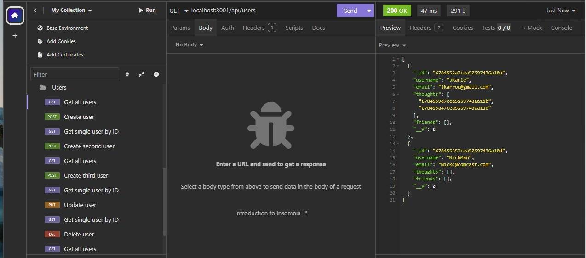
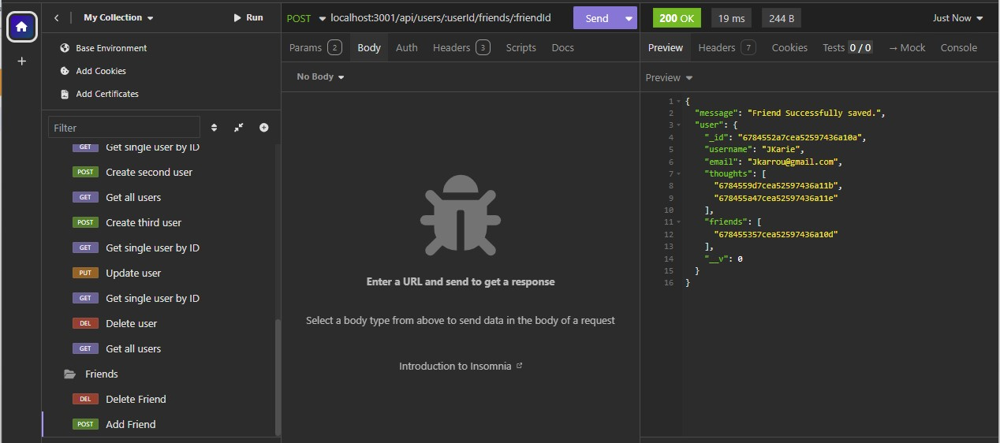
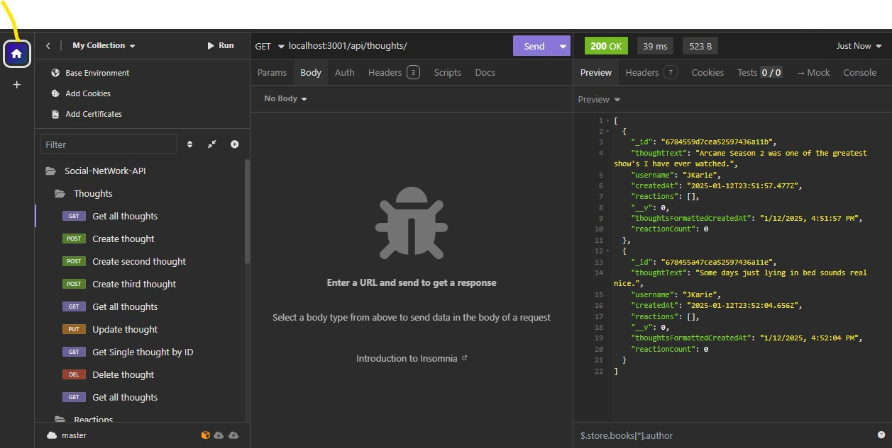
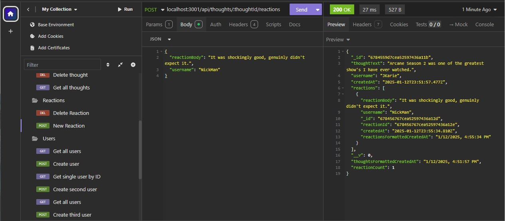

# Social Network API

This is a simple social network API built with MongoDB and TypeScript. It allows users to create accounts, add friends, post thoughts, and react to other users' thoughts.

## Features

- **User Management:**
  - Create and manage user profiles
  - View user details

- **Friendship System:**
  - Add friends
  - Remove friends
  - View friends list

- **Thoughts:**
  - Create and post thoughts
  - Edit and Delete thoughts
  - View thoughts of users

- **Reactions:**
  - React to a thought with a comment

## Tech Stack

- **MongoDB**: Database to store user data, thoughts, and reactions.
- **TypeScript**: Used for building the API with static typing for improved developer experience.
- **Express**: Server-side framework to handle routing and API logic.
  
## API Endpoints

### 1. **User Management**

- `POST /api/users` - Create a new user
  - Request body: 
    ```json
    {
      "username": "user1",
      "email": "user1@example.com",
    }
    ```
  - Response:
    ```json
    {
      "id": "12345",
      "username": "user1",
      "email": "user1@example.com",
      "thoughts": [],
      "friends": []
    }
    ```

- `GET /api/users/:userId` - Get user profile details by ID
  - Response:
    ```json
    {
      "id": "12345",
      "username": "user1",
      "email": "user1@example.com"
      "thoughts": [],
      "friends": []
    }
    ```

### 2. **Friendship Management**

- `POST /api/users/:userId/friends/:friendId` - Add a friend
  - Response:
    ```json
    {
      "message": "Friend successfully saved."
    }
    ```

### 3. **Thoughts**

- `POST api//thoughts` - Post a new thought
  - Request body:
    ```json
    {
      "userId": "12345",
      "username": "user1",
      "thoughtText": "example 1",
    }
    ```
  - Response:
    ```json
    {
      "message": "Thought added to user",
    }
    ```

### 4. **Reactions**

- `POST /api/thoughts/:thoughtId/reactions` - Post a reaction comment to a thought
  - Request body:
    ```json
    {
        "username": "user 1"
        "reactionBody": "Shockingly good!"
    }
    ```
  - Response:
    ```json
    {
      "message": "Reaction posted successfully"
    }
    ```

## Installation

To host this API, you will need to either download the repository locally or host it. To startup the server and API, the admin will need to enter
`npm install` 

to install the necesarry dependencies. Once the dependencies have been installed, environment variables will need to be setup either locally or on the host.
The server is already set-up to connect to database, it will just need to be connected to the database by entering a url for the enviornment variable:
`MONGODB_URI`

Once this has all been set-up, simply run the server by entering the command: 
`npm run start`

## Testing the API
You can use a variety of tools to test the functionality of this server, for development testing Insomnia was used for this project.
Here are some demonstrations of what the data looks like using insomnia:









## Contributing
Feel free to fork the project, create issues and submit pull requests. Contributions are welcome!

##License
This project is licensed under the MIT license.
